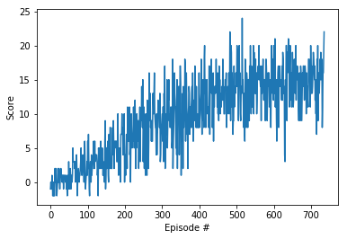

# Deep Q-Learning for Navigation in Unity ML-Agents Framework

In this project, an AI agent is trained to navigate (and collect bananas!) in a large, square world. 

A reward of +1 is provided for collecting a yellow banana, and a reward of -1 is provided for collecting a blue banana. Thus, the goal of your agent is to collect as many yellow bananas as possible while avoiding blue bananas.

The state space has 37 dimensions and contains the agent's velocity, along with ray-based perception of objects around the agent's forward direction. Given this information, the agent has to learn how to best select actions. Four discrete actions are available, corresponding to:

```
    0 - move forward.
    1 - move backward.
    2 - turn left.
    3 - turn right.
```

The task is episodic, and in order to solve the environment, the agent must get an average score of +13 over 100 consecutive episodes.

The project environment is similar to, but not identical to the Banana Collector environment on the Unity [ML-Agents GitHub page](https://github.com/Unity-Technologies/ml-agents/blob/master/docs/Learning-Environment-Examples.md#banana-collector). 

## Train Agent

The code to train agent for navigating the environment is provided in ```train_agent``` jupyter notebook. This trains the agent, and after reaching a satisfactory score, it stops the training and saves the model weights to file.  

Although, the agent is said to solve the environment if it gets an average score of +13 over 100 consecutive episodes, I use a threshold of +15 while training to make sure that agent always performs well. During the testing, I use a score of +13 to evaluate agent's performance.  

The agent was able to solve the environment by reaching an average score of +13 in less that 600 episodes. Plot of rewards per episode is shown below.




## Test Agent  

The code to test agent's performance for navigating the environment is provided in ```test_agent``` jupyter notebook.  

## Deep Q-Network  

The Deep Q-Network is implemented in PyTorch and consists of 3 hidden fully-connected layers. Input to this model is agent's state as observed by the environment which is a vector of size 37. Output of the model is a vector of size 4 corresponding to the agent's action-value estimate. Dimensions for this model were chosen as: ```Input(37)->FC1(64)->FC2(128)->FC3(64)->Output(4)```


## Learning Algorithm (Pipeline)

The following pipeline was employed for training the agent.

 - Create 2 models (Q-Networks).
 - For episode in total number of episodes:
    - For step in total number of steps:
        - Select an epsilon-greedy action ‘a’ using the prediction by model 1 for state ‘s’.
        - Apply the action. Observe next state AND reward.
        - Store these in memory for replaying through them later.
        - If **N** number of steps have been observed, go into the learning stage using the experience so far.
        - Sample a batch of length N from the memory.
            - For vectors of ‘s’, predict set of action-value vector using model 2.
            - Update the action-value vector using an algorithm such as sarsamax, or expected sarsamax.
            - Train Model 1 (optimize using back-propagation with MSE loss) to bring the output of Model 1 closer to output of Model 2.
            - Copy the network weights from Model 1 to Model 2 using ‘soft-update’ function.
        - Repeat
        
---

## Future Improvements

The following future improvements is planned for this task:

 - Using pixel information by capturing the image from a first person's perspective, converting it to grayscale, resizing to 84x84, stacking up to 4 past frames to get the temporal information and building a 84x84x4 sized input. The agent will be able to estimate action-value function by using just this input.  
 - Use of [Double DQN](https://arxiv.org/abs/1509.06461) for improved learning.  
 - [Prioritized Experience Replay](https://arxiv.org/abs/1511.05952) for sampling probability adjustment.  
 - [Dueling Network Architecture](https://arxiv.org/abs/1511.06581) for better action-value estimation.  